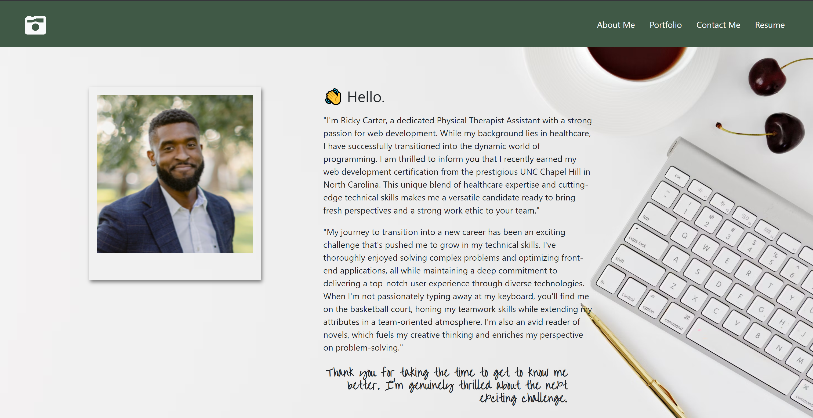

# React Portfolio

## Description

Fully responsive React portfolio built with Vite.js. Utilizing React-Bootstrap as a CSS framework. Syntactically Awesome Stylesheets (Sass) integrated for enhanced styling over traditional CSS. React-Icons and FontAwesome incorporated for a diverse set of icons. Text animations added to the Homepage, using the React-Text-Transition Node.js dependency. Netlify serverless forms enabled to facilitate email configuration for the Contact page. Hosted and deployed on Netlify.

## Link to the Deployed Application

- <a href="https://main--nimble-shortbread-456155.netlify.app/">Click Here</a>

## Usage

- #### Click on the hyperlink above. Check it out!

## Credits

- Youtube, ChatGPT, docs, collegues from UNC-Chapel Hill full stack bootcamp.

## License

- #### This application is covered under the [MIT License](./LICENSE).
